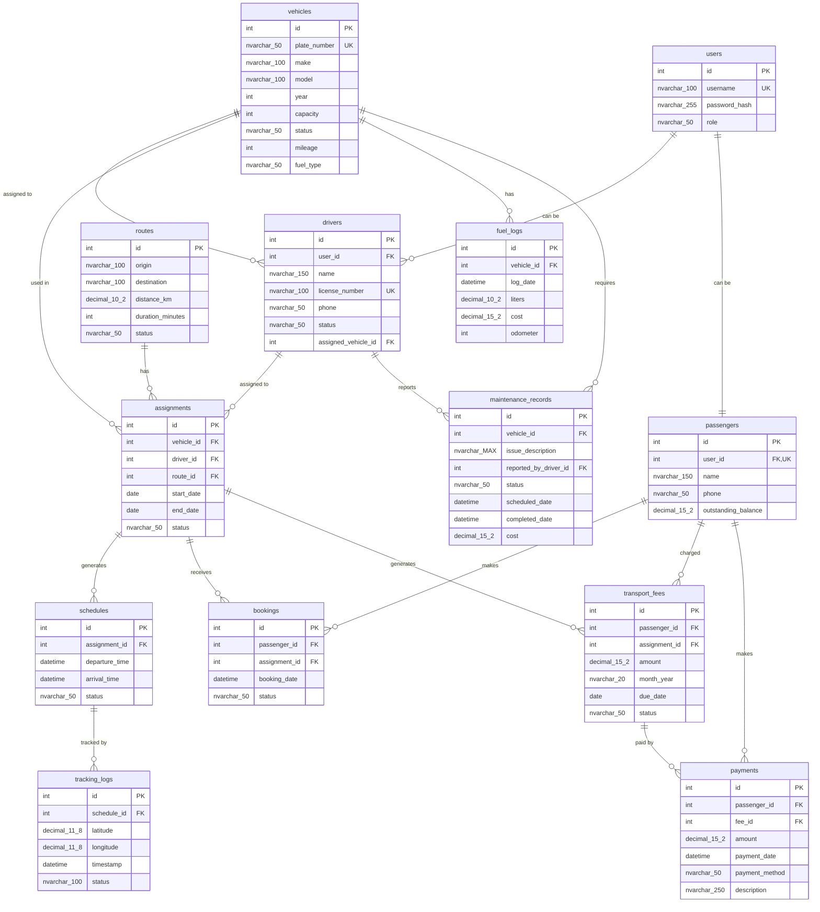

# Transport Management System - Database Schema Documentation

## Database Configuration

| Property | Value |
|----------|-------|
| **Database Name** | `TransportDB` |
| **Server** | `localhost\SQLEXPRESS` |
| **Driver** | ODBC Driver 17 for SQL Server |
| **Authentication** | Windows Trusted Connection |
| **Connection File** | `config.py`, `database/connection.py` |

---

## Tables Overview (13 Tables)

| # | Table | Purpose | Primary Usage Location |
|---|-------|---------|----------------------|
| 1 | `users` | User authentication & role management | `models/user_model.py` |
| 2 | `vehicles` | Fleet/inventory management | `models/vehicle_model.py` |
| 3 | `drivers` | Driver records & assignments | `models/driver_model.py` |
| 4 | `routes` | Transport routes (origin/destination) | `models/route_model.py` |
| 5 | `assignments` | Links vehicles, drivers, and routes | `models/assignment_model.py`, `services/assignment_service.py` |
| 6 | `schedules` | Trip departure/arrival times | `models/schedule_model.py`, `views/admin/schedule_management.py` |
| 7 | `passengers` | Passenger profiles & balances | `models/passenger_model.py`, `models/payment_model.py` |
| 8 | `bookings` | Passenger trip reservations | `models/passenger_model.py`, `services/assignment_service.py` |
| 9 | `transport_fees` | Monthly fee billing records | `models/payment_model.py`, `services/payment_service.py` |
| 10 | `payments` | Payment transaction history | `models/payment_model.py`, `controllers/payment_controller.py` |
| 11 | `fuel_logs` | Fuel consumption tracking | `models/fuel_model.py` |
| 12 | `maintenance_records` | Vehicle maintenance issues | `models/maintenance_model.py`, `services/maintenance_service.py` |
| 13 | `tracking_logs` | GPS location tracking data | `views/admin/tracking_panel.py` |

---

## Detailed Table Specifications

### 1. users
**Purpose:** Stores authentication credentials and user roles

| Column | Type | Constraints | Description |
|--------|------|-------------|-------------|
| `id` | INT | PK, Identity | Auto-increment primary key |
| `username` | NVARCHAR(100) | NOT NULL, UNIQUE | Login username |
| `password_hash` | NVARCHAR(255) | NOT NULL | Hashed password |
| `role` | NVARCHAR(50) | NOT NULL | User role (Administrator, Driver, Passenger, Maintenance) |

**Usage Locations:**
- `models/user_model.py` - Authentication queries
- `setup_database.py` - Seed data insertion

**Relationships:**
- One-to-One: `passengers` (via `user_id`)
- One-to-Many: `drivers` (via `user_id`)

---

### 2. vehicles
**Purpose:** Fleet management - stores all transport vehicles

| Column | Type | Constraints | Description |
|--------|------|-------------|-------------|
| `id` | INT | PK, Identity | Auto-increment primary key |
| `plate_number` | NVARCHAR(50) | NOT NULL, UNIQUE | Vehicle license plate |
| `make` | NVARCHAR(100) | NOT NULL | Manufacturer (e.g., Toyota) |
| `model` | NVARCHAR(100) | NOT NULL | Model name (e.g., HiAce) |
| `year` | INT | NOT NULL | Manufacturing year |
| `capacity` | INT | NOT NULL, DEFAULT 4 | Passenger capacity |
| `status` | NVARCHAR(50) | NOT NULL, DEFAULT 'Available' | Current status |
| `mileage` | INT | NOT NULL, DEFAULT 0 | Current odometer reading |
| `fuel_type` | NVARCHAR(50) | DEFAULT 'Petrol' | Fuel type |

**Usage Locations:**
- `models/vehicle_model.py` - CRUD operations
- `models/assignment_model.py` - Join queries
- `services/assignment_service.py` - Status updates

**Relationships:**
- One-to-Many: `drivers` (assigned_vehicle_id)
- One-to-Many: `assignments` (vehicle_id)
- One-to-Many: `fuel_logs` (vehicle_id)
- One-to-Many: `maintenance_records` (vehicle_id)

---

### 3. drivers
**Purpose:** Driver records linked to users and vehicles

| Column | Type | Constraints | Description |
|--------|------|-------------|-------------|
| `id` | INT | PK, Identity | Auto-increment primary key |
| `user_id` | INT | FK → users(id) | Link to user account |
| `name` | NVARCHAR(150) | NOT NULL | Driver full name |
| `license_number` | NVARCHAR(100) | NOT NULL, UNIQUE | Driver's license |
| `phone` | NVARCHAR(50) | NULL | Contact number |
| `status` | NVARCHAR(50) | NOT NULL, DEFAULT 'Available' | Current status |
| `assigned_vehicle_id` | INT | FK → vehicles(id) | Currently assigned vehicle |

**Usage Locations:**
- `models/driver_model.py` - CRUD operations
- `models/assignment_model.py` - Join queries
- `models/maintenance_model.py` - Driver-reported issues
- `services/assignment_service.py` - Status validation

**Relationships:**
- Many-to-One: `users` (user_id)
- Many-to-One: `vehicles` (assigned_vehicle_id)
- One-to-Many: `assignments` (driver_id)
- One-to-Many: `maintenance_records` (reported_by_driver_id)

---

### 4. routes
**Purpose:** Defines transport routes with origin/destination

| Column | Type | Constraints | Description |
|--------|------|-------------|-------------|
| `id` | INT | PK, Identity | Auto-increment primary key |
| `origin` | NVARCHAR(100) | NOT NULL | Starting location |
| `destination` | NVARCHAR(100) | NOT NULL | Ending location |
| `distance_km` | DECIMAL(10,2) | NOT NULL | Distance in kilometers |
| `duration_minutes` | INT | NOT NULL | Estimated trip duration |
| `status` | NVARCHAR(50) | DEFAULT 'Active' | Route status |

**Usage Locations:**
- `models/route_model.py` - CRUD operations
- `models/assignment_model.py` - Join queries
- `models/schedule_model.py` - Route display
- `models/payment_model.py` - Fee calculations

**Relationships:**
- One-to-Many: `assignments` (route_id)

---

### 5. assignments
**Purpose:** Links vehicles, drivers, and routes for active services

| Column | Type | Constraints | Description |
|--------|------|-------------|-------------|
| `id` | INT | PK, Identity | Auto-increment primary key |
| `vehicle_id` | INT | FK → vehicles(id), NOT NULL | Assigned vehicle |
| `driver_id` | INT | FK → drivers(id), NOT NULL | Assigned driver |
| `route_id` | INT | FK → routes(id), NOT NULL | Assigned route |
| `start_date` | DATE | NOT NULL | Assignment start date |
| `end_date` | DATE | NULL | Assignment end date (if closed) |
| `status` | NVARCHAR(50) | DEFAULT 'Active' | Assignment status |

**Usage Locations:**
- `models/assignment_model.py` - Creation, active queries
- `services/assignment_service.py` - Business logic, passenger allocation
- `views/admin/tracking_panel.py` - Route display
- `views/admin/driver_management.py` - Cascade delete
- `views/admin/schedule_management.py` - Cleanup operations

**Relationships:**
- Many-to-One: `vehicles`, `drivers`, `routes`
- One-to-Many: `schedules` (assignment_id)
- One-to-Many: `bookings` (assignment_id)
- One-to-Many: `transport_fees` (assignment_id)

---

### 6. schedules
**Purpose:** Trip schedules with departure and arrival times

| Column | Type | Constraints | Description |
|--------|------|-------------|-------------|
| `id` | INT | PK, Identity | Auto-increment primary key |
| `assignment_id` | INT | FK → assignments(id), NOT NULL | Parent assignment |
| `departure_time` | DATETIME | NOT NULL | Scheduled departure |
| `arrival_time` | DATETIME | NOT NULL | Scheduled arrival |
| `status` | NVARCHAR(50) | NOT NULL, DEFAULT 'Scheduled' | Schedule status |

**Usage Locations:**
- `models/schedule_model.py` - Query operations
- `services/assignment_service.py` - Auto-generation on assignment creation
- `views/admin/schedule_management.py` - CRUD UI
- `models/passenger_model.py` - Booking display

**Relationships:**
- Many-to-One: `assignments` (assignment_id)
- One-to-Many: `tracking_logs` (schedule_id)

---

### 7. passengers
**Purpose:** Passenger profiles linked to user accounts

| Column | Type | Constraints | Description |
|--------|------|-------------|-------------|
| `id` | INT | PK, Identity | Auto-increment primary key |
| `user_id` | INT | FK → users(id), NOT NULL, UNIQUE | Link to user account |
| `name` | NVARCHAR(150) | NOT NULL | Passenger name |
| `phone` | NVARCHAR(50) | NULL | Contact number |
| `outstanding_balance` | DECIMAL(15,2) | DEFAULT 0.00 | Current balance due |

**Usage Locations:**
- `models/passenger_model.py` - Booking queries
- `models/payment_model.py` - Balance updates, payment history
- `services/payment_service.py` - Billing status

**Relationships:**
- One-to-One: `users` (user_id)
- One-to-Many: `bookings` (passenger_id)
- One-to-Many: `transport_fees` (passenger_id)
- One-to-Many: `payments` (passenger_id)

---

### 8. bookings
**Purpose:** Links passengers to specific assignments/trips

| Column | Type | Constraints | Description |
|--------|------|-------------|-------------|
| `id` | INT | PK, Identity | Auto-increment primary key |
| `passenger_id` | INT | FK → passengers(id), NOT NULL | Booking passenger |
| `assignment_id` | INT | FK → assignments(id), NOT NULL | Selected assignment |
| `booking_date` | DATETIME | DEFAULT GETDATE() | Booking timestamp |
| `status` | NVARCHAR(50) | NOT NULL, DEFAULT 'Confirmed' | Booking status |

**Usage Locations:**
- `models/passenger_model.py` - Query passenger bookings
- `services/assignment_service.py` - Capacity validation, fee generation

**Relationships:**
- Many-to-One: `passengers` (passenger_id)
- Many-to-One: `assignments` (assignment_id)

---

### 9. transport_fees
**Purpose:** Monthly transport fee billing records

| Column | Type | Constraints | Description |
|--------|------|-------------|-------------|
| `id` | INT | PK, Identity | Auto-increment primary key |
| `passenger_id` | INT | FK → passengers(id), NOT NULL | Billed passenger |
| `assignment_id` | INT | FK → assignments(id), NOT NULL | Related assignment |
| `amount` | DECIMAL(15,2) | NOT NULL | Fee amount |
| `month_year` | NVARCHAR(20) | NOT NULL | Billing period (e.g., "January 2025") |
| `due_date` | DATE | NOT NULL | Payment deadline |
| `status` | NVARCHAR(50) | DEFAULT 'Unpaid' | Payment status |

**Usage Locations:**
- `models/payment_model.py` - Fee generation, outstanding queries
- `services/payment_service.py` - Automated fee generation
- `services/assignment_service.py` - Fee creation on passenger allocation

**Relationships:**
- Many-to-One: `passengers` (passenger_id)
- Many-to-One: `assignments` (assignment_id)
- One-to-Many: `payments` (fee_id)

---

### 10. payments
**Purpose:** Records all payment transactions

| Column | Type | Constraints | Description |
|--------|------|-------------|-------------|
| `id` | INT | PK, Identity | Auto-increment primary key |
| `passenger_id` | INT | FK → passengers(id), NOT NULL | Paying passenger |
| `fee_id` | INT | FK → transport_fees(id), NULL | Related fee (optional) |
| `amount` | DECIMAL(15,2) | NOT NULL | Payment amount |
| `payment_date` | DATETIME | DEFAULT GETDATE() | Payment timestamp |
| `payment_method` | NVARCHAR(50) | DEFAULT 'Cash' | Payment method |
| `description` | NVARCHAR(250) | NULL | Payment notes |

**Usage Locations:**
- `models/payment_model.py` - Payment recording, history queries
- `controllers/payment_controller.py` - Payment listing
- `services/payment_service.py` - Payment processing

**Relationships:**
- Many-to-One: `passengers` (passenger_id)
- Many-to-One: `transport_fees` (fee_id)

---

### 11. fuel_logs
**Purpose:** Tracks fuel consumption per vehicle

| Column | Type | Constraints | Description |
|--------|------|-------------|-------------|
| `id` | INT | PK, Identity | Auto-increment primary key |
| `vehicle_id` | INT | FK → vehicles(id), NOT NULL | Vehicle refueled |
| `log_date` | DATETIME | DEFAULT GETDATE() | Refuel timestamp |
| `liters` | DECIMAL(10,2) | NOT NULL | Fuel quantity |
| `cost` | DECIMAL(15,2) | NOT NULL | Total cost |
| `odometer` | INT | NOT NULL | Odometer reading at refuel |

**Usage Locations:**
- `models/fuel_model.py` - Fuel log queries

**Relationships:**
- Many-to-One: `vehicles` (vehicle_id)

---

### 12. maintenance_records
**Purpose:** Vehicle maintenance issues and repair tracking

| Column | Type | Constraints | Description |
|--------|------|-------------|-------------|
| `id` | INT | PK, Identity | Auto-increment primary key |
| `vehicle_id` | INT | FK → vehicles(id), NOT NULL | Vehicle needing repair |
| `issue_description` | NVARCHAR(MAX) | NOT NULL | Problem description |
| `reported_by_driver_id` | INT | FK → drivers(id), NULL | Reporting driver |
| `status` | NVARCHAR(50) | NOT NULL, DEFAULT 'Reported' | Repair status |
| `scheduled_date` | DATETIME | NULL | Scheduled repair date |
| `completed_date` | DATETIME | NULL | Actual completion date |
| `cost` | DECIMAL(15,2) | DEFAULT 0.00 | Repair cost |

**Usage Locations:**
- `models/maintenance_model.py` - Issue reporting, scheduling, completion
- `services/maintenance_service.py` - Business logic

**Relationships:**
- Many-to-One: `vehicles` (vehicle_id)
- Many-to-One: `drivers` (reported_by_driver_id)

---

### 13. tracking_logs
**Purpose:** GPS location tracking for scheduled trips

| Column | Type | Constraints | Description |
|--------|------|-------------|-------------|
| `id` | INT | PK, Identity | Auto-increment primary key |
| `schedule_id` | INT | FK → schedules(id), NOT NULL | Related schedule |
| `latitude` | DECIMAL(11,8) | NOT NULL | GPS latitude |
| `longitude` | DECIMAL(11,8) | NOT NULL | GPS longitude |
| `timestamp` | DATETIME | DEFAULT GETDATE() | Location timestamp |
| `status` | NVARCHAR(100) | NULL | Tracking status (Normal/Deviated) |

**Usage Locations:**
- `views/admin/tracking_panel.py` - Full CRUD UI with deviation detection
- `views/admin/driver_management.py` - Cascade delete cleanup
- `views/admin/schedule_management.py` - Schedule deletion cleanup

**Relationships:**
- Many-to-One: `schedules` (schedule_id)

---

## Entity Relationship Diagram

---

## Key Database Operations

### Transaction Patterns

The application uses several multi-query transactions for data integrity:

1. **Assignment Creation** (`services/assignment_service.py`)
   - Insert assignment → Update vehicle status → Update driver status

2. **Passenger Allocation** (`services/assignment_service.py`)
   - Insert booking → Generate transport fee → Update passenger balance

3. **Payment Recording** (`models/payment_model.py`)
   - Insert payment → Update passenger outstanding balance → Update fee status

4. **Maintenance Issue Reporting** (`models/maintenance_model.py`)
   - Insert maintenance record → Update vehicle status to 'Needs Maintenance'

5. **Maintenance Completion** (`models/maintenance_model.py`)
   - Update maintenance record → Update vehicle status to 'Available'

6. **Cascade Deletes** (in view files)
   - Delete tracking logs → Delete schedules → Delete assignments → Delete driver

---

## Schema File

**Location:** `database/schema.sql`

The schema uses T-SQL syntax with:
- `IF OBJECT_ID` checks for idempotent drops
- `GO` batch separators
- Proper foreign key constraints
- Default values for timestamps and status fields

---

## Removed Tables (Cleanup)

The following tables were removed from the schema as they were unused:

| Table | Reason for Removal |
|-------|-------------------|
| `stops` | No application code referenced this table |
| `audit_logs` | No logging implementation in the application |

*Note: DROP statements for these tables remain in the schema to clean up existing databases.*
